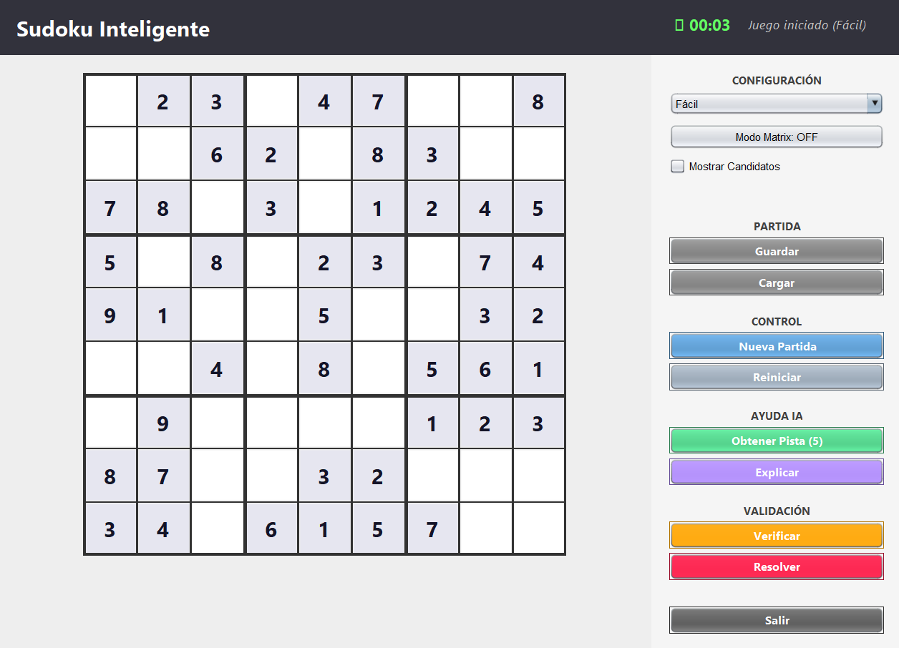

# Sudoku GUI App

> **Bloque Prolog del portafolio (2 de 2).** La lógica de validación/resolución vive en Prolog (`programa/logic.pl`) invocada desde Java Swing vía subproceso `swipl` (`PrologBridge.java`). El otro mecanismo de integración — microservicio HTTP/JSON en SWI-Prolog — está en [Aventura-del-Tesoro-Perdido](https://github.com/Geovanni-Gonzalez/Aventura-del-Tesoro-Perdido).

[](https://github.com/Geovanni-Gonzalez/Sudoku-GUI-App/actions/workflows/ci.yml)

## Descripción
Aplicación gráfica de Sudoku en Java con integración Prolog para lógica de resolución o validación y guardado local.

## Objetivo
Practicar integración Java-Prolog, GUI y reglas lógicas para resolver un juego.

## Tecnologías utilizadas
- Java
- Swing
- Prolog
- Archivos .dat

## Funcionalidades principales
- Tablero gráfico
- Puente Java-Prolog
- logic.pl con reglas
- saved_game.dat

## Mi rol
Implementé interfaz, puente Prolog y gestión de estado.

## Aprendizajes clave
- Paradigmas imperativo/lógico
- Grids Java
- Persistencia simple
- Reglas Sudoku

## Instalación y ejecución
```bash
cd Sudoku-GUI-App/programa/src
javac *.java
java Main
```
Requiere Java y SWI-Prolog disponible como `swipl` en el PATH, según `PrologBridge.java`.

## Estructura del proyecto
- programa/src/: Java
- programa/logic.pl: reglas
- programa/saved_game.dat: estado

## Capturas o demo


## Estado del proyecto
Proyecto académico funcional/experimental.

## Valor técnico demostrado
Demuestra integración Java con lógica declarativa.

## Mejoras futuras
- Documentar instalación de SWI-Prolog por sistema operativo
- Generador de tableros
- Build reproducible

## Autor
Geovanni González  
Estudiante de Ingeniería en Computación  
GitHub: [Geovanni-Gonzalez](https://github.com/Geovanni-Gonzalez)


